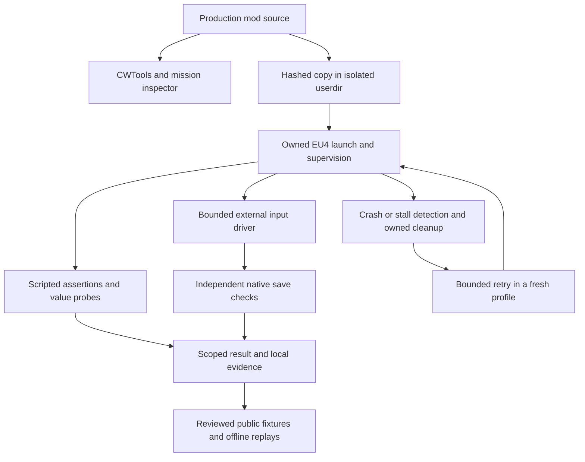

# EU4 Modding Automation & Black-Box Verification

A Windows research project exploring how to build and verify mods for a closed-source
interactive application. Europa Universalis IV is the target; the engineering work
combines static analysis, isolated native tests, process supervision, runtime assertions,
bounded UI input and independent saved-state checks.

This is an active development repository. Brittany Missions is the established mod;
American Century is a second, growing USA mission project. Neither is certified as a
complete release package. [Current status](docs/STATUS.md) and
[USA slice results](docs/testing/american-century/README.md) define the actual scope.

## Why this is interesting

An interface that records completion can skip the behavior being tested. In fresh
Nantes experiments, EU4 console/script commands recorded a mission as completed
without granting its production rewards. A real mission-button action granted the
rewards and immediately unlocked the next mission. Some console queries also returned
false despite positive numeric observations and native saved state.

The harness therefore distinguishes trigger logic, scripted effects, mission wiring,
actual UI dispatch, reward quantities and persistence. A static pass, clean log or
completion flag cannot substitute for all those layers.
[Investigation and evidence](docs/testing/runtime-mission-claim/README.md).

## Workflow



Production content stays under `mod/`. Shared tooling stages byte-preserving copies,
adds test-only hooks and checks source/staged validation before launching the game.
The runner uses process identities, a lifecycle lock and explicit profile ownership;
it refuses unrelated EU4 sessions. Assertion failures stop; selected infrastructure
failures can retry after successful owned cleanup. Raw profiles, logs, saves and
screenshots remain local. Small reviewed evidence supports replayable regression tests.

## Evidence-supported results

| Capability | Verified scope |
| --- | --- |
| Native regression | Four Brittany contracts: preview predicate, conditional shipbuilding reward, alliance-dependent diplomatic reward and installed textiles-building helper; static wiring checked separately |
| Faithful input | One Nantes claim and fresh unready refusal, using actual pointer input and independent before/after saves; both permanent rewards once and immediate downstream readiness |
| USA slice | Vanilla formation by real input, four production claims, 31 save/input checks and 12 ordinary reload comparisons; separate eight-check unready contract |
| Recovery | Controlled owned exit, native crash/reporter cleanup and an actual after-BEGIN suspension; fresh retry and separate clean suites afterward |
| Offline regression | Current publication check: 53 Node tests plus four tool self-test programs; no installed game or input adapter required |

The latest historical native development check recorded **51 shared Node tests**;
the publication work adds four config/audit tests. Two of the resulting 55 tests
exercise the real Windows process adapter and are separate from the 53-test offline
command. See [publication validation](docs/PUBLICATION.md) for current results and
[coverage](docs/testing/runtime-coverage.md) for boundaries. Replays check evaluators
against retained observations; they do not launch another game session.

## Run without EU4

Install Node.js 24 (tested locally with 24.19.0); no npm dependencies are needed.
From the repository root:

```shell
node tools/test-offline.mjs
node tools/publication/check-links.mjs
node tools/publication/audit.mjs
```

The offline command runs assertion, wiring, lifecycle simulation, evidence replay,
input/save contracts, configuration checks and synthetic tool self-tests. It writes
only ignored test output. GitHub Actions runs these checks on Linux and Windows.
CI does **not** run EU4, CWTools's installed server or real gameplay input.

## Local EU4 validation and testing

Native development is Windows-specific and requires a licensed installed EU4 copy,
Steam in a usable authenticated state, Windows PowerShell 5.1, Node on PATH and the
CWTools VS Code extension. VS Code need not be open. The evidenced target is
**EU4 1.37.5.0 Inca (491d)**; `1.37.*` descriptor metadata is not broader compatibility
evidence. The [environment](docs/testing/environment.md) lists 18 required DLC;
later native saves record 21 actually enabled DLC. Minimum/exactly-18 support remains
unverified. No game files, DLC, CWTools binary or rules snapshot are bundled.

Configure paths using [setup instructions](docs/SETUP.md). Public defaults assume
the usual Steam installation; custom libraries use `EU4_GAME_PATH`. The ordinary
profile uses Windows Documents discovery or `EU4_USER_DIR`. Ignored `config.local.json`
overrides and committed examples support local configuration without editing shared files.

```powershell
./tools/cwtools/install-rules.ps1   # network needed only for rule installation
./tools/validate-cwtools.ps1
./tools/validate-cwtools.ps1 -Mod american_century
node --test tools/runtime-tests/windows-adapter.test.mjs
# Requires the documented launcher configuration and desktop graphics:
./tools/run-eu4-test.ps1 -Test all -TimeoutSeconds 150
```

The native runner reads the ordinary launcher configuration, builds fresh isolated
`-userdir` profiles in ignored `tools/runtime-tests/work/`, and never overwrites the
installed game or ordinary profile. It is **not headless**. Default lifecycle limits
are 120 seconds total, 30 seconds without assertion progress and one retry; explicit
bounds are available. Cleanup verifies identities before terminating owned processes.
[Testing guide](docs/TESTING.md) and [runner documentation](tools/runtime-tests/README.md)
cover outcomes, preparation-only mode, negative controls and recovery.

Faithful UI tests additionally require an active Codex session with the historical
supported Windows `node_repl` / `@oai/sky` input adapter. Bare PowerShell cannot operate
that handoff. The verified UI condition is a 1280×720 client, scale 1 and initial tree
scroll; screenshots and fresh owned-window identities must be inspected before input.
This adapter is environment-provided and not a bundled standalone automation service.
[Nantes operator contract](tools/runtime-tests/README.md#faithful-nantes-claim) and
[USA playtests](docs/testing/american-century/README.md#playtest-list) give exact steps.

## Repository map

| Path | Purpose |
| --- | --- |
| `mod/brittany_missions/`, `mod/american_century/` | Project mod source; installed helpers/assets are external dependencies |
| `tools/` | PowerShell entry points, Node implementations, synthetic fixtures and regression tests |
| `docs/modding/` | Versioned mechanics guides, identifiers and minimal adapted examples |
| `docs/testing/` | Scenarios, coverage, historical reports and reviewed textual evidence |
| `docs/{PROJECT,DESIGN,STATUS,ROADMAP,DECISIONS,TESTING}.md` | Durable project knowledge and active development state |
| `AGENTS.md`, `.agent/` | Codex integrity instructions and execution plans |
| `.local/` and ignored tool output | Machine configuration, raw evidence and audit originals; never public |

[Project map](PROJECT_STRUCTURE.md), [contribution workflow](CONTRIBUTING.md) and
[public-repository hygiene](docs/REPOSITORY_HYGIENE.md) explain ongoing development.
The prepared workspace itself now has clean Git metadata; original private history
is archived locally. Continue developing here with ignored local config/evidence
and the configured staged-content commit hook. Repeated exports are unnecessary.

## Limitations and next work

There is no whole-mod campaign, AI, multiplayer or general version/DLC certification.
Brittany retains 58 CWTools warnings and duplicate localisation findings. Most mission
dispatch/persistence/expiry scenarios remain open. UI automation supports bounded
known layouts and an external active driver; locked desktops and unusual unidentifiable
dialogs need further evidence. USA currently implements nine USA and three colonial
missions; the proposed 55-mission USA tree is still being developed.

Follow the [roadmap](docs/ROADMAP.md) and linked playtests. Public evidence uses synthetic
paths and preserves failed verdicts. Game screenshots and bulk engine dumps are retained
locally pending ownership review, so readers cannot replay the original visual inspection
from the public textual fixtures alone.

## Ownership and publication

Europa Universalis IV is developed and published by Paradox. This independent project
is not affiliated with or endorsed by Paradox. EU4 assets and trademarks belong to
their respective owners; access to installed game content does not grant redistribution
rights. This repository supplies project tooling/mod content and references external
game definitions; it does not supply the game.

Licensing is pending owner review; no open-source license grant is implied yet.
MIT is recommended for confirmed project-owned code, with third-party/runtime material
explicitly outside its scope. [Audit and licensing review](docs/PUBLICATION.md) identifies
the remaining decisions, including preservation of the original private Git history. No
remote, commit or push was created by the publication preparation.
